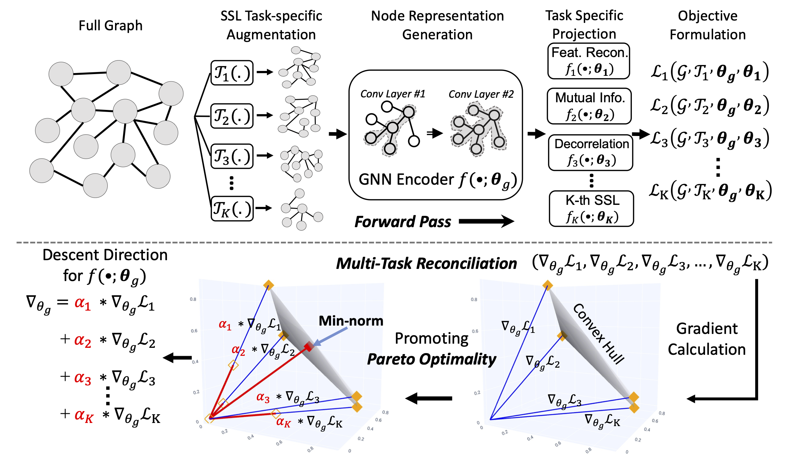

# Official repository for ICLR'23 paper: Multi-task Self-supervised Graph Neural Network Enable Stronger Task Generalization



Hi all, this is the official repository for ICLR 2023 paper: **Multi-task Self-supervised Graph Neural Network Enable Stronger Task Generalization**. Our paper can be found at [[OpenReview link]](https://openreview.net/forum?id=1tHAZRqftM). We sincerely apprecaite your interests in our projects!

## Instruction

To reproduce our experiment, you need to first run the python code ```hetero_graph_gen.py``` to generate the DGL graph objects for heterophilous graphs (i.e., Chameleon, Actor, and Squirrel) and ```link_gen.py``` to prepare training/validation/testing splits for the evaluation on link prediciton. The ```link_gen.py``` may require an environment with 128GB RAM due to the size of ogb-product graph. If you have limited RAM and are not interested in running experiments about ogb-product, you can comment out its link generation code block. 

You can finish these two steps by simply run commands as follows:

```
python hetero_graph_gen.py
python link_gen.py
```

Then to conduct multi-task self-supervised learning, we have prepared bash scripts in the ```bash``` directory. Training a ParetoGNN can be done by:

```
cd bash

\\ to generate node embeddings for node-level tasks like node classification, node clustering, and partition prediction
bash ssnc_{dataset}.sh <GPU_ID> 

\\ to generate node embeddings for link prediction
bash link_{dataset}.sh <GPU_ID> 
```

The node embeddings and the final model will be saved in the ```bash``` directory.

To conduct evaluation, please run our evaluation script:

```
python eval.py --data {dataset} --embedding_path_node {path_to_emb_node} --embedding_path_link {path_to_emb_link}
```

## Dependencies and Environments
The package we use include:
    
    * DGL 0.9.0
    * PyTorch 1.12.0
    * ogb 1.3.4

We aim at training our models on GPUs with 24 GB VRAM. Examplary bash scripts we provide should run without problems on 24 GB GPUs. 

## Cite
If you find this repository useful in your research, please cite our paper:

```bibtex
@article{ju2023multi,
  title={Multi-task Self-supervised Graph Neural Networks Enable Stronger Task Generalization},
  author={Ju, Mingxuan and Zhao, Tong and Wen, Qianlong and Yu, Wenhao and Shah, Neil and Ye, Yanfang and Zhang, Chuxu},
  booktitle={International Conference on Learning Representations},
  year={2023}
}
```

## Credit
Some scripts about the pre-text tasks come from the [example directory from the official repository of DGL](https://github.com/dmlc/dgl/tree/master/examples/pytorch). And some data generation scripts for link prediction come from the [CFLP repo](https://github.com/DM2-ND/CFLP). 

## Contact
Mingxuan Ju (mju2@nd.edu)
